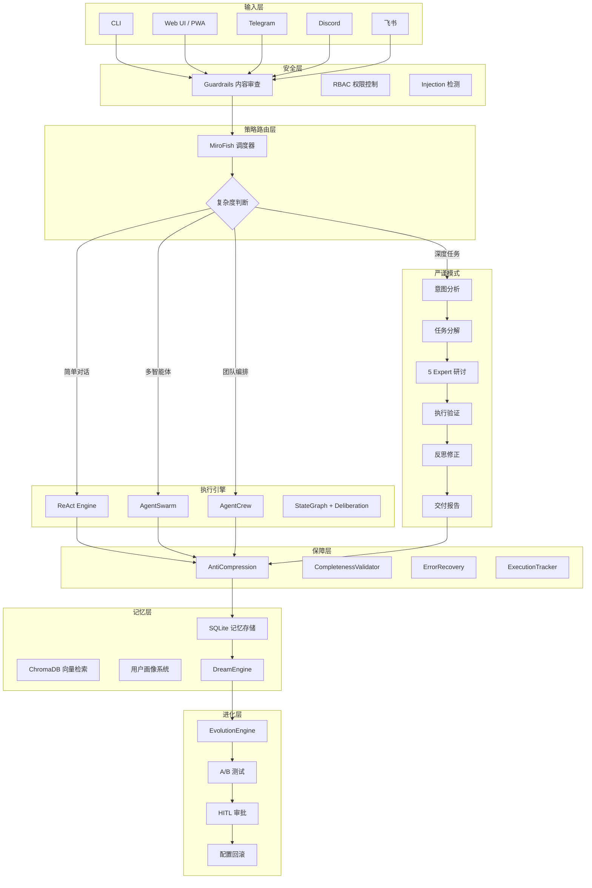

<div align="center">

<h1>◈ NexusAgent</h1>

<p><strong>一个像资深工程师一样严谨工作的本地优先 AI Agent 框架</strong></p>
<p><em>A local-first AI Agent framework that works with the rigor of a senior engineer</em></p>

<!-- Badges -->
<a href="https://github.com/qize-auto/nexus-agent/actions"></a>
<a href="https://www.python.org/downloads/"></a>
<a href="LICENSE"></a>
<a href="#"></a>

<br><br>


</div>

---

## 🎯 30 秒快速开始

```bash
# 1. 克隆
git clone https://github.com/qize-auto/nexus-agent.git
cd nexus-agent

# 2. 安装
pip install -e .

# 3. 设置主密钥（自动引导）
export NEXUS_MASTER_KEY=$(python -c 'import base64,os;print(base64.b64encode(os.urandom(32)).decode())')

# 4. 启动
python -m nexusagent.main
```

然后输入任意任务，NexusAgent 会自动判断走**严谨执行模式**还是**对话模式**。

---

## ✨ v4.0+ 新特性

<table>
<tr>
<td width="50%">

### 🔬 严谨执行模式

不是所有请求都一样处理。NexusAgent 会像真正的工程师一样：
- **意图分析** → 判断是任务还是闲聊
- **需求澄清** → 模糊时主动追问，不猜不错
- **任务分解** → 拆成原子步骤，每步带验证标准
- **5 Expert 研讨** → 架构师/安全员/产品经理/测试/运维多角度审查
- **执行+验证** → 做完一步验一步，失败自动重试
- **反思修正** → 错了分析根因，改计划再试
- **结构化交付** → Markdown 报告，改了什么、为什么、怎么验证

</td>
<td width="50%">

### 🧠 梦境引擎 + 自我进化

- **DreamEngine**：空闲时自动加工用户画像，合并偏好、解决冲突、遗忘过时信息
- **EvolutionEngine**：三档模式（off/notify/auto），自动分析运行数据并生成优化建议
- **HITL 审批**：高置信度自动部署，低置信度人工确认，支持 A/B 测试和一键回滚

</td>
</tr>
<tr>
<td width="50%">

### 🛡️ 防偷懒执行保障

- **AntiCompression**：检测输出被截断、步骤被跳过
- **CompletenessValidator**：验证执行完整性，不遗漏文件
- **ErrorRecovery**：工具调用失败时自动换工具、改参数、降级执行
- **执行追踪**：每一步耗时、成本、状态全记录

</td>
<td width="50%">

### 🏗️ 模块化注册体系

- **ModuleRegistry**：55+ 核心模块统一注册，依赖拓扑排序自动初始化
- **双向同步**：模块 self-register + bootstrap 预注册，互不冲突
- **健康检查**：每个模块独立 health_check，失败安全回退
- **标准化模板**：`nexus module init <name>` 一键创建符合规范的新模块

</td>
</tr>
</table>

---

## 📸 界面预览

### Web UI — 暗黑模式

<div align="center">

<br>
<em>左侧会话列表 · 顶部模型切换 · 中间 SSE 流式输出 · 底部输入区</em>
</div>

<br>

### Web UI — 功能卡片

<div align="center">

<br>
<em>欢迎页快捷功能卡片：代码助手、文档分析、图像理解、联网搜索</em>
</div>

<br>

### CLI 模式

<div align="center">

<br>
<em>命令行交互 + 20+ 子命令：doctor / benchmark / backup / evolution / mode ...</em>
</div>

> 📷 *截图说明：实际截图请按 [`docs/screenshots/README.md`](docs/screenshots/README.md) 步骤捕获并替换以上占位图。*

---

## 🏗️ 架构全景



---

## 🚀 核心能力一览

| 能力 | 说明 | 状态 |
|------|------|------|
| 🔬 **严谨执行模式** | 意图分析 → 澄清 → 分解 → 研讨 → 执行 → 验证 → 反思 → 交付 | ✅ v4.0+ |
| 🧠 **梦境引擎** | 空闲自动加工用户画像，合并偏好、解决冲突、遗忘过期 | ✅ v4.0+ |
| 🧬 **自我进化** | 自动分析运行数据，生成优化建议，支持 HITL 审批 + A/B 测试 | ✅ v4.0+ |
| 🛡️ **防偷懒保障** | AntiCompression + CompletenessValidator + ErrorRecovery | ✅ v4.0+ |
| 🔧 **工具系统** | 55+ 内置工具，统一注册标准，自动发现与加载 | ✅ v4.0+ |
| 🎭 **多策略编排** | ReAct / Swarm / MiroFish / Crew / StateGraph 自动路由 | ✅ v3.3+ |
| 🏛️ **5 Expert 研讨** | 架构师、安全员、产品经理、测试、运维多角度辩论 | ✅ v4.0+ |
| 💾 **记忆系统** | SQLite + ChromaDB + 用户画像 + AES-256 加密 | ✅ v3.3+ |
| 🔌 **13+ LLM 提供商** | DeepSeek / Moonshot / OpenAI / Claude / Gemini / Azure ... | ✅ v3.3+ |
| 📡 **多通道** | CLI / Web / Desktop / Telegram / Discord / 飞书 | ✅ v3.3+ |
| 📊 **可观测性** | 审计日志、健康检查、基准测试、回归测试 | ✅ v4.0+ |

---

## 🔌 支持的 LLM 提供商

| 区域 | 提供商 | 环境变量 | 热门模型 |
|------|--------|----------|----------|
| 🇨🇳 国内 | **DeepSeek** | `DEEPSEEK_API_KEY` | deepseek-chat, deepseek-v4-pro |
| 🇨🇳 国内 | **Moonshot / Kimi** | `MOONSHOT_API_KEY` | moonshot-v1-8k/32k/128k |
| 🇨🇳 国内 | **通义千问** | `DASHSCOPE_API_KEY` | qwen-max, qwen-plus |
| 🇨🇳 国内 | **文心一言** | `QIANFAN_API_KEY` | ernie-bot |
| 🇨🇳 国内 | **智谱 GLM** | `ZHIPU_API_KEY` | glm-4 |
| 🇨🇳 国内 | **Ollama 本地** | 无需 Key | llama3.2, qwen2.5 ... |
| 🌍 国际 | **OpenAI** | `OPENAI_API_KEY` | gpt-4o, gpt-4o-mini |
| 🌍 国际 | **Anthropic** | `ANTHROPIC_API_KEY` | claude-3-5-sonnet |
| 🌍 国际 | **Google** | `GOOGLE_API_KEY` | gemini-1.5-pro |
| 🌍 国际 | **Azure** | `AZURE_OPENAI_API_KEY` | azure/gpt-4o |
| 🌍 国际 | **Groq** | `GROQ_API_KEY` | llama-3.3-70b |

运行时热切换，一行代码即可换模型：

```python
agent.reload_llm("deepseek", "deepseek-chat")
agent.reload_llm("anthropic", "claude-3-5-sonnet")
agent.reload_llm("ollama", "llama3.2")
```

---

## 🧪 测试与质量

```bash
# 运行全部测试
pytest tests/

# 当前基线
# 968 passed, 3 skipped, 0 failed
```

| 测试类别 | 数量 | 覆盖范围 |
|----------|------|----------|
| 单元测试 | 600+ | 核心引擎、安全、记忆、工具 |
| 集成测试 | 100+ | ReAct、RAG、多模型、流式 |
| 端到端测试 | 18 | 梦境引擎、进化系统、5 Expert 研讨 |
| 回归测试 | 50+ | 跨版本兼容性 |

---

## 🎮 CLI 命令速查

```bash
nexus mode <auto|strict|chat|status>   # 切换严谨/对话模式
nexus evolution <status|review|run>     # 自我进化系统
nexus dream now                         # 手动触发梦境周期
nexus tool <ls|info|search>             # 工具管理
nexus profile <show|learn|forget>       # 用户画像
nexus backup <create|list|restore>      # 记忆备份
nexus benchmark                         # LLM 性能基准测试
nexus doctor                            # 运行全部诊断检查
```

---

## 📁 项目结构

```
nexus-agent/
├── nexusagent/              # 核心框架
│   ├── execution/           # ReAct、StateGraph、严谨模式、防偷懒
│   ├── orchestration/       # Orchestrator、MiroFish 调度器
│   ├── security/            # Guardrails、RBAC、沙箱
│   ├── memory/              # SQLite、ChromaDB、用户画像、备份
│   ├── agents/              # AgentSwarm、AgentCrew
│   ├── tools/               # 工具注册中心、55+ 内置工具
│   ├── interface/           # CLI / Web / 多通道适配器
│   ├── cognition/           # DreamEngine、UserProfiler
│   ├── evolution/           # EvolutionEngine、A/B 测试、HITL
│   ├── models/              # 模型路由、13+ 提供商后端
│   ├── benchmark/           # 性能基准测试框架
│   ├── diagnostics/         # 健康检查、诊断报告
│   └── core/                # 模块注册中心、引导系统
├── tests/                   # 968 个测试
├── docs/                    # 文档与截图
├── desktop/                 # PWA 桌面客户端
├── templates/               # 模块创建模板
├── docker-compose.yml       # Docker 部署
└── README.md                # 本文件
```

---

## 📚 文档导航

| 文档 | 说明 |
|------|------|
| [`docs/QUICKSTART.md`](docs/QUICKSTART.md) | 5 分钟上手完整指南 |
| [`docs/VERIFICATION_CHECKLIST.md`](docs/VERIFICATION_CHECKLIST.md) | 功能验证清单与手动测试步骤 |
| [`STABILIZATION_PLAN.md`](STABILIZATION_PLAN.md) | 项目稳定化方案（风险评估 + 修复计划） |
| [`AGENTS.md`](AGENTS.md) | 面向 Agent 的编码约定与项目规范 |

---

## 🤝 参与贡献

1. Fork 本仓库
2. 创建分支：`git checkout -b feature/amazing-feature`
3. 提交改动：`git commit -m 'Add amazing feature'`
4. 推送分支：`git push origin feature/amazing-feature`
5. 发起 Pull Request

**开发纪律**：
- 每次提交必须通过 `pytest tests/`（968+ passed）
- 新功能必须附带单元测试 + 集成测试
- 禁止 async/sync 混用，禁止裸 `except Exception`

---

## 📜 许可证

[Apache License 2.0](LICENSE)

---

<div align="center">

**NexusAgent** — *Built with rigor. Evolves with you.*

</div>
