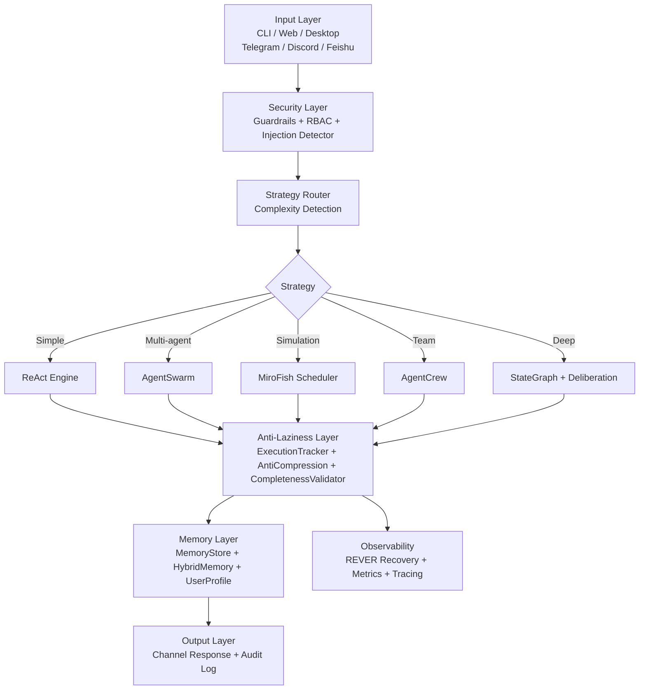

# NexusAgent

> **NexusAgent** is a local-first AI Agent framework with **anti-laziness execution guards** and **multi-strategy auto-orchestration** (ReAct / Swarm / MiroFish / Crew).
>
> NexusAgent 是一个本地优先的 AI Agent 框架，具备**防偷懒执行保障**和**多策略自动编排**能力（ReAct / Swarm / MiroFish / Crew）。

<!-- TODO: 开源前替换 qize-auto 为实际 GitHub 组织/用户名 -->
[](https://github.com/qize-auto/nexus-agent/actions)
[](https://www.python.org/downloads/)
[](LICENSE)

---

## 🚀 30-Second Quickstart / 30 秒快速开始

```bash
# Clone 克隆
# GitHub Repository
git clone https://github.com/qize-auto/nexus-agent.git
cd nexus-agent

# Install 安装
pip install -e .

# Configure (optional) 配置（可选）
cp .env.example .env
# Edit .env and add your API key 编辑 .env 添加你的 API 密钥

# Run CLI 运行命令行
python run_cli.py
```

Then type any task and press Enter. 然后输入任意任务并按回车即可。

---

## ✨ Why NexusAgent? / 为什么选择 NexusAgent？

| Dimension / 维度 | **NexusAgent** | LangChain | AutoGPT | CrewAI |
|---|---|---|---|---|
| **Anti-laziness guards / 防偷懒机制** | ✅ `AntiCompression` + `CompletenessValidator` | ❌ None | ❌ None | ❌ None |
| **Multi-strategy auto-routing / 多策略自动路由** | ✅ `MiroFish` dynamically picks ReAct/Swarm/Crew | ⚠️ Manual switch | ❌ Fixed ReAct | ❌ Fixed Crew |
| **Local-first / 本地优先** | ✅ Runs locally by default, cloud optional | ⚠️ Cloud-first | ⚠️ Cloud-first | ⚠️ Cloud-first |
| **End-to-end observability / 端到端可观测** | ✅ `REVER` fault recovery + tracing | ⚠️ Basic callbacks | ❌ Weak | ⚠️ Basic |
| **Real-time diagnostics / 实时诊断** | ✅ WebSocket alerts + `nexus doctor` | ❌ None | ❌ None | ❌ None |
| **User profiling / 用户画像系统** | ✅ `DreamEngine` + real-time profiling | ❌ None | ❌ None | ❌ None |
| **HITL support / 人工介入** | ✅ Built-in `HITLManager` | ⚠️ External | ❌ None | ❌ None |

---

## 🏗️ Architecture / 架构



---

## 📁 Project Structure / 项目结构

```
nexus-agent/
├── nexusagent/              # Core framework / 核心框架
│   ├── execution/           # ReActEngine, StateGraph, Tracker, Anti-Laziness
│   ├── orchestration/       # Orchestrator, MiroFish Scheduler
│   ├── security/            # Guardrails, Sandbox, Injection Detector
│   ├── memory/              # MemoryStore, HybridMemory, UserProfile
│   ├── agents/              # AgentSwarm, AgentCrew, MessageBus
│   ├── tools/               # ToolRegistry, Browser, Code Interpreter, FileOps
│   ├── interface/           # Channel adapters (CLI, Web, Telegram, etc.)
│   ├── diagnostics/         # Health, Connectivity, Audit, UX, Alert Scheduler
│   ├── cognition/           # DreamEngine, UserProfiler, CostEnforcer
│   ├── models/              # ModelRouter, LLM backends
│   ├── context/             # SlidingWindow context manager
│   └── config/              # Configuration and settings
├── tests/                   # 600+ tests / 600+ 个测试
├── examples/                # Showcase examples / 示例场景
│   ├── cross_dept_report/   # MiroFish multi-strategy demo
│   ├── personal_assistant/  # Profiling + long-term memory demo
│   └── code_review_bot/     # Anti-laziness code review demo
├── run_cli.py               # CLI entrypoint / 命令行入口
├── run_web.py               # Web server entrypoint / Web 服务入口
├── run_desktop.py           # Desktop client entrypoint / 桌面客户端入口
├── main.py                  # Programmatic API / 编程式 API
├── requirements.txt         # Dependencies / 依赖
└── README.md                # This file
```

---

## 🧪 Testing / 测试

```bash
# Run all tests 运行全部测试
pytest

# Run with coverage 带覆盖率运行
pytest --cov=nexusagent tests/

# Run specific batch 运行特定批次
pytest tests/test_core.py tests/test_security.py -v
```

**Current status / 当前状态**: `604 passed` — all green.

---

## 🔌 LLM Provider Configuration / LLM 提供商配置

NexusAgent uses a **Unified Backend** powered by [litellm](https://github.com/BerriAI/litellm), supporting **all major domestic and international LLM providers** through a single `UnifiedLLMBackend` class.

### Supported Providers / 支持的提供商

| Region | Provider | Key Env Var | Popular Models |
|--------|----------|-------------|----------------|
| 🇨🇳 Domestic | **DeepSeek** | `DEEPSEEK_API_KEY` | deepseek-chat, deepseek-v4-pro, deepseek-reasoner |
| 🇨🇳 Domestic | **Moonshot / Kimi** | `MOONSHOT_API_KEY` | moonshot-v1-8k/32k/128k, kimi-k2-6 |
| 🇨🇳 Domestic | **Alibaba Qwen** | `DASHSCOPE_API_KEY` | qwen-max, qwen-plus, qwen-turbo |
| 🇨🇳 Domestic | **Baidu Wenxin** | `QIANFAN_API_KEY` | ernie-bot, ernie-bot-turbo |
| 🇨🇳 Domestic | **Zhipu GLM** | `ZHIPU_API_KEY` | glm-4, glm-3-turbo |
| 🇨🇳 Domestic | **Xiaomi** | `XIAOMI_API_KEY` | mi-llm-pro |
| 🌍 International | **OpenAI** | `OPENAI_API_KEY` | gpt-4o, gpt-4o-mini, o1, o3-mini |
| 🌍 International | **Anthropic Claude** | `ANTHROPIC_API_KEY` | claude-3-5-sonnet, claude-3-opus |
| 🌍 International | **Google Gemini** | `GOOGLE_API_KEY` | gemini-1.5-pro, gemini-1.5-flash |
| 🌍 International | **Azure OpenAI** | `AZURE_OPENAI_API_KEY` | azure/gpt-4o, azure/gpt-4-turbo |
| 🌍 International | **Groq** | `GROQ_API_KEY` | llama-3.3-70b, mixtral-8x7b |
| 🌍 International | **Together AI** | `TOGETHER_API_KEY` | Llama-3, Qwen, Mistral |

### Quick Config / 快速配置

```bash
# .env
NEXUS_LLM_PROVIDER=deepseek
DEEPSEEK_API_KEY=sk-your-key-here
NEXUS_DEFAULT_MODEL=deepseek-chat
```

### Runtime Switching / 运行时切换

```python
from nexusagent.main import NexusAgent

agent = NexusAgent()
await agent.initialize()

# Switch to any provider / 切换到任意提供商
agent.reload_llm("openai", "gpt-4o-mini")
agent.reload_llm("anthropic", "claude-3-5-sonnet-20241022")
agent.reload_llm("kimi", "kimi-k2-6")
```

### Custom Provider / 自定义提供商

```python
from nexusagent.models.unified_backend import ProviderRegistry, ProviderConfig, UnifiedLLMBackend

registry = ProviderRegistry()
registry.register(ProviderConfig(
    name="custom",
    display_name="My Custom LLM",
    base_url="https://api.custom-llm.com/v1",
    api_key_env="CUSTOM_API_KEY",
    default_model="custom-model-v1",
))

backend = UnifiedLLMBackend(provider="custom", model="custom-model-v1")
```

---

## 🛡️ Safety & Observability / 安全与可观测

- **Guardrails**: Dual-layer review (input + output) with deny-list and heuristic injection detection.
- **REVER Protocol**: Automatic retry, fallback, and escalation on execution failure.
- **Anti-Laziness**: Detects output truncation, skipped steps, and premature termination.
- **Diagnostics**: Real-time health monitoring with WebSocket alerts and `nexus doctor` CLI.
- **User Profiling**: `DreamEngine` periodically consolidates user traits for personalized responses.
- **HITL**: Built-in human-in-the-loop approval for sensitive operations.

---

## 📚 Documentation / 文档

| Document | Description |
|----------|-------------|
| `README.md` | This file — quickstart and overview |
| `CONTRIBUTING.md` | How to contribute 贡献指南 |
| `CODE_OF_CONDUCT.md` | Community standards 社区准则 |
| `ARCHITECTURE_BLUEPRINT_v4.0.md` | Deep-dive architecture 深度架构设计 |
| `AGENTS.md` | Agent-facing conventions 面向 Agent 的约定 |

---

## 📜 License / 许可证

Licensed under the [Apache License 2.0](LICENSE).

---

## 🤝 Contributing / 参与贡献

We welcome contributions! Please see [CONTRIBUTING.md](CONTRIBUTING.md) for guidelines.

欢迎贡献！请参阅 [CONTRIBUTING.md](CONTRIBUTING.md) 了解指南。
